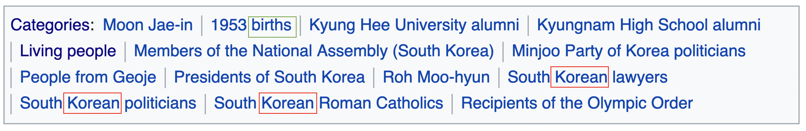

# name2nat: a Python package for nationality prediction from a name

__name2nat__ is a Python package that predicts the nationality of any name written in Roman letters.
For example, it returns the correct output `Korean` for my name `Kyubyong Park'.
Needless to say, it is not possible to guess somebody's nationality 100% right from their name.
After all, nationality can change, you know.
However, it is also true that there is a tendency between names and nationality.
So it turns out statistical classifiers for this task works to some extent.
Details are explained below.

## NaNa Dataset

### Construction
I constructed a new dataset for this project because I failed to find any available dataset that is big and comprehensive enough.

* STEP 1. Downloaded and extracted the 20200601 English wiki dump (enwiki-20200601-pages-articles.xml).
* STEP 2. Iterated all pages and collected the title and the nationality. 
I regarded the title as a person if the Category section at the bottom of each page included ... births (green rectangule),
and identified their nationality from the most frequent nationality word in the section (red rectangules).

* STEP 3. Randomly split the data into train/dev/test in the ratio of 8:1:1 within each nationality group.

### Stats
|Nationality|# Samples|Train|Dev|Test|
|--|--|--|--|--|
|__Total__ |__1,112,902__|__890,248__|__111,286__|__111,368__|
|Afghan|973|778|97|98|
|Albanian|2,742|2,193|274|275|
|Algerian|1,991|1,592|199|200|
|American|302,215|241,772|30,221|30,222|
|Andorran|236|188|24|24|
|Angolan|630|504|63|63|
|Argentine|11,158|8,926|1,116|1,116|
|Armenian|2,001|1,600|200|201|
|Aruban|117|93|12|12|
|Australian|50,670|40,536|5,067|5,067|
|Austrian|11,490|9,192|1,149|1,149|
|Azerbaijani|1,664|1,331|166|167|
|Bahamian|292|233|29|30|
|Bahraini|297|237|30|30|
|Bangladeshi|2,045|1,636|204|205|
|Barbadian|466|372|47|47|
|Basque|1,202|961|120|121|
|Belarusian|2,923|2,338|292|293|
|Belgian|9,884|7,907|988|989|
|Belizean|186|148|19|19|
|Beninese|249|199|25|25|
|Bermudian|338|270|34|34|
|Bhutanese|180|144|18|18|
|Bolivian|822|657|82|83|
|Bosniak|102|81|10|11|
|Botswana|315|252|31|32|
|Brazilian|14,043|11,234|1,404|1,405|
|Breton|148|118|15|15|
|British|57,403|45,922|5,740|5,741|
|Bruneian|144|115|14|15|
|Bulgarian|4,908|3,926|491|491|
|Burkinabé|362|289|36|37|
|Burmese|1,180|944|118|118|
|Burundian|175|140|17|18|
|Cambodian|451|360|45|46|
|Cameroonian|1,286|1,028|129|129|
|Canadian|42,691|34,152|4,269|4,270|
|Catalan|2,147|1,717|215|215|
|Chadian|174|139|17|18|
|Chilean|3,548|2,838|355|355|
|Chinese|11,868|9,494|1,187|1,187|
|Colombian|3,276|2,620|328|328|
|Comorian|68|54|7|7|
|Congolese|44|35|4|5|
|Cuban|2,423|1,938|242|243|
|Cypriot|1,271|1,016|127|128|
|Czech|9,056|7,244|906|906|
|Dane|41|32|4|5|
|Djiboutian|68|54|7|7|
|Dominican|1,976|1,580|198|198|
|Dutch|18,645|14,916|1,864|1,865|
|Ecuadorian|1,093|874|109|110|
|Egyptian|3,471|2,776|347|348|
|Emirati|777|621|78|78|
|English|96,449|77,159|9,645|9,645|
|Equatoguinean|242|193|24|25|
|Eritrean|167|133|17|17|
|Estonian|2,536|2,028|254|254|
|Ethiopian|917|733|92|92|
|Faroese|355|284|35|36|
|Filipino|4,910|3,928|491|491|
|Finn|85|68|8|9|
|French|51,052|40,841|5,105|5,106|
|Gabonese|226|180|23|23|
|Gambian|276|220|28|28|
|Georgian|328|262|33|33|
|German|52,986|42,388|5,299|5,299|
|Ghanaian|2,546|2,036|255|255|
|Gibraltarian|123|98|12|13|
|Greek|7,469|5,975|747|747|
|Grenadian|174|139|17|18|
|Guatemalan|704|563|70|71|
|Guinean|731|584|73|74|
|Guyanese|448|358|45|45|
|Haitian|702|561|70|71|
|Honduran|626|500|63|63|
|Hungarian|9,026|7,220|903|903|
|I-Kiribati|51|40|5|6|
|Indian|28,365|22,692|2,836|2,837|
|Indonesian|3,525|2,820|352|353|
|Iranian|6,263|5,010|626|627|
|Iraqi|1,566|1,252|157|157|
|Irish|14,806|11,844|1,481|1,481|
|Israeli|6,437|5,149|644|644|
|Italian|36,671|29,336|3,667|3,668|
|Jamaican|1,778|1,422|178|178|
|Japanese|26,520|21,216|2,652|2,652|
|Jordanian|613|490|61|62|
|Kazakh|31|24|3|4|
|Kenyan|2,012|1,609|201|202|
|Korean|9,871|7,896|987|988|
|Kuwaiti|496|396|50|50|
|Kyrgyz|20|16|2|2|
|Lao|33|26|3|4|
|Latvian|2,117|1,693|212|212|
|Lebanese|1,558|1,246|156|156|
|Liberian|368|294|37|37|
|Libyan|339|271|34|34|
|Lithuanian|2,474|1,979|247|248|
|Macedonian|1,374|1,099|137|138|
|Malagasy|290|232|29|29|
|Malawian|274|219|27|28|
|Malaysian|3,228|2,582|323|323|
|Maldivian|191|152|19|20|
|Malian|482|385|48|49|
|Maltese|829|663|83|83|
|Manx|188|150|19|19|
|Marshallese|40|32|4|4|
|Mauritanian|120|96|12|12|
|Mauritian|329|263|33|33|
|Mexican|10,810|8,648|1,081|1,081|
|Moldovan|1,250|1,000|125|125|
|Mongolian|631|504|63|64|
|Montenegrin|1,194|955|119|120|
|Moroccan|1,822|1,457|182|183|
|Mozambican|263|210|26|27|
|Namibian|736|588|74|74|
|Nauruan|40|32|4|4|
|Nepalese|967|773|97|97|
|Nicaraguan|357|285|36|36|
|Nigerian|5,075|4,060|507|508|
|Nigerien|179|143|18|18|
|Norwegian|16,891|13,512|1,689|1,690|
|Omani|247|197|25|25|
|Pakistani|4,703|3,762|470|471|
|Palauan|44|35|4|5|
|Palestinian|660|528|66|66|
|Panamanian|593|474|59|60|
|Paraguayan|1,266|1,012|127|127|
|Peruvian|1,902|1,521|190|191|
|Portuguese|5,918|4,734|592|592|
|Qatari|685|548|68|69|
|Romanian|8,189|6,551|819|819|
|Russian|26,593|21,274|2,659|2,660|
|Rwandan|337|269|34|34|
|Salvadoran|634|507|63|64|
|Sammarinese|248|198|25|25|
|Samoan|746|596|75|75|
|Saudi|1,871|1,496|187|188|
|Senegalese|1,029|823|103|103|
|Serb|56|44|6|6|
|Singaporean|1,646|1,316|165|165|
|Slovak|3,584|2,867|358|359|
|Slovene|111|88|11|12|
|Somali|145|116|14|15|
|Sotho|62|49|6|7|
|Sudanese|436|348|44|44|
|Surinamese|250|200|25|25|
|Swazi|143|114|14|15|
|Syriac|98|78|10|10|
|Syrian|1,309|1,047|131|131|
|Taiwanese|2,433|1,946|243|244|
|Tajik|77|61|8|8|
|Tamil|1,749|1,399|175|175|
|Tanzanian|784|627|78|79|
|Thai|3,434|2,747|343|344|
|Tibetan|332|265|33|34|
|Togolese|264|211|26|27|
|Tongan|570|456|57|57|
|Tunisian|1,340|1,072|134|134|
|Turk|99|79|10|10|
|Tuvaluan|83|66|8|9|
|Ugandan|1,316|1,052|132|132|
|Ukrainian|7,748|6,198|775|775|
|Uruguayan|2,834|2,267|283|284|
|Uzbek|78|62|8|8|
|Vanuatuan|146|116|15|15|
|Venezuelan|2,422|1,937|242|243|
|Vietnamese|1,572|1,257|157|158|
|Vincentian|10|8|1|1|
|Welsh|6,588|5,270|659|659|
|Yemeni|403|322|40|41|
|Zambian|638|510|64|64|

### Downloadable Link
* You can download the dataset [here](https://www.kaggle.com/bryanpark/nana-dataset).

## name2nat

### Installation
```
pip install name2nat
```

### Usage
```
>>> from name2nat import Name2nat

>>> my_nanat = Name2nat()

>>> names = ["Donald Trump", # American
         "Moon Jae-in", # Korean
         "Shinzo Abe", # Japanese
         "Xi Jinping", # Chinese
         "Joko Widodo", # Indonesian
         "Angela Merkel", # German
         "Emmanuel Macron", # French
         "Kyubyong Park", # Korean
         "Yamamoto Yu", # Japanese
         "Jing Xu"] # Chinese
>>> result = my_nanat(names, top_n=3)
>>> print(result)
# (name, [(nationality, prob), ...])
# Note that prob of 1.0 indicates the name exists
# in Wikipedia.
[
('Donald Trump', [('American', 1.0)])
('Moon Jae-in', [('Korean', 1.0)])
('Shinzo Abe', [('Japanese', 1.0)])
('Xi Jinping', [('Chinese', 1.0)])
('Joko Widodo', [('Indonesian', 1.0)])
('Angela Merkel', [('German', 1.0)])
('Emmanuel Macron', [('French', 1.0)])
('Kyubyong Park', [('Korean', 0.9985014200210571), ('American', 0.000289416522718966), ('Bhutanese', 0.00025851925602182746)])
('Yamamoto Yu', [('Japanese', 0.7050493359565735), ('Taiwanese', 0.12779785692691803), ('Chinese', 0.04263153299689293)])
('Jing Xu', [('Chinese', 0.8626819252967834), ('Taiwanese', 0.09901007264852524), ('American', 0.022995812818408012)])
]
```

### Training
I use a powerful NLP library [Flair](https://github.com/flairNLP/flair) to train a text classifier model.
A bidirectional GRU layer is employed.
```
python train.py
```

### Evaluation
```
python predict.py;
python eval.py --gt nana/test.tgt --pred test.pred
```

### Results
|K | Precision@K | 
|--|--|
|1| 61310/111368=55.1|
|2|77480/111368=69.6|
|3|86703/111368=77.9 | 
|4|92491/111368=83.0|
|5|96697/111368=86.8|

### References

If you use this code for research, please cite:

```
@misc{park2018name2nat,
  author = {Park, Kyubyong},
  title = {name2nat: a Python package for nationality prediction from a name},
  year = {2020},
  publisher = {GitHub},
  journal = {GitHub repository},
  howpublished = {\url{https://github.com/Kyubyong/name2nat}}
}
```

